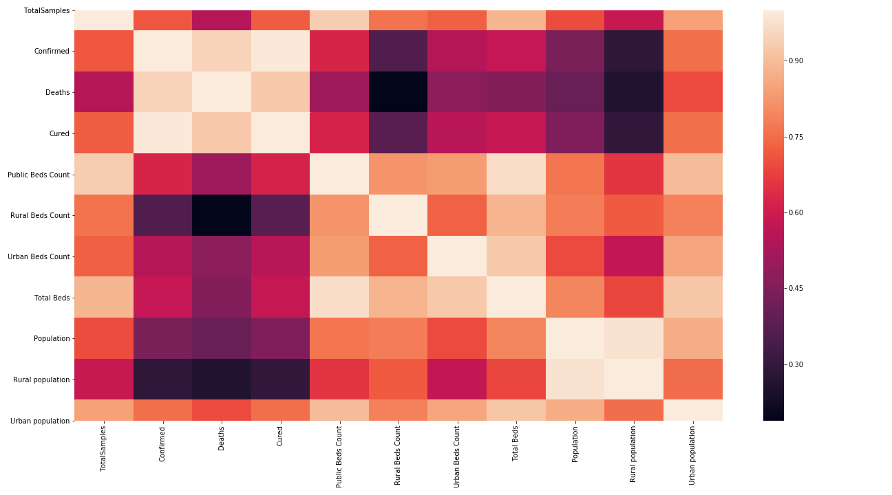
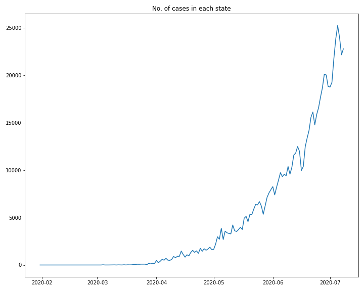
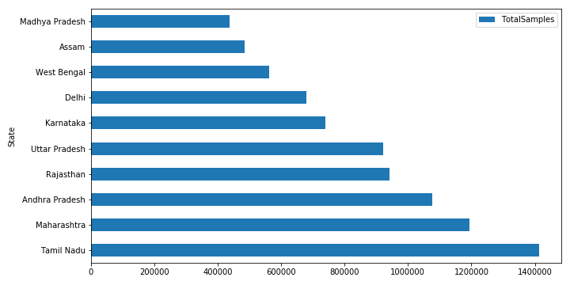

# covid19_research
 
## Background
Coronavirus disease (COVID-19) is an infectious disease caused by a newly discovered coronavirus. Most people infected with the COVID-19 virus will experience mild to moderate respiratory illness and recover without requiring special treatment.  Older people, and those with underlying medical problems like cardiovascular disease, diabetes, chronic respiratory disease, and cancer are more likely to develop serious illness.
The best way to prevent and slow down transmission is be well informed about the COVID-19 virus, the disease it causes and how it spreads. Protect yourself and others from infection by washing your hands or using an alcohol based rub frequently and not touching your face. 
The COVID-19 virus spreads primarily through droplets of saliva or discharge from the nose when an infected person coughs or sneezes, so it’s important that you also practice respiratory etiquette (for example, by coughing into a flexed elbow).
At this time, there are no specific vaccines or treatments for COVID-19. However, there are many ongoing clinical trials evaluating potential treatments. WHO will continue to provide updated information as soon as clinical findings become available.

## Project Aim
This project aims at doing an in depth Exploratory Data Analysis on the Coronavirus datasets available. This analysis tries to cover demographics for multiple regions and tries to figure out commonalities in order to get key insights regarding te spread of virus. Currently the project is focused on India's Coronavirus datasets available on Kaggle.

## Exploratory Data Analysis

## Future Goal

- This project will be expanded across multiple countries in order to get an insight into what factors influence the spread of virus and what measures reduces the death rates.
- Feature extraction
- Estimating cases and deaths in the upcoming months through various models.
- Gaining more insights.
